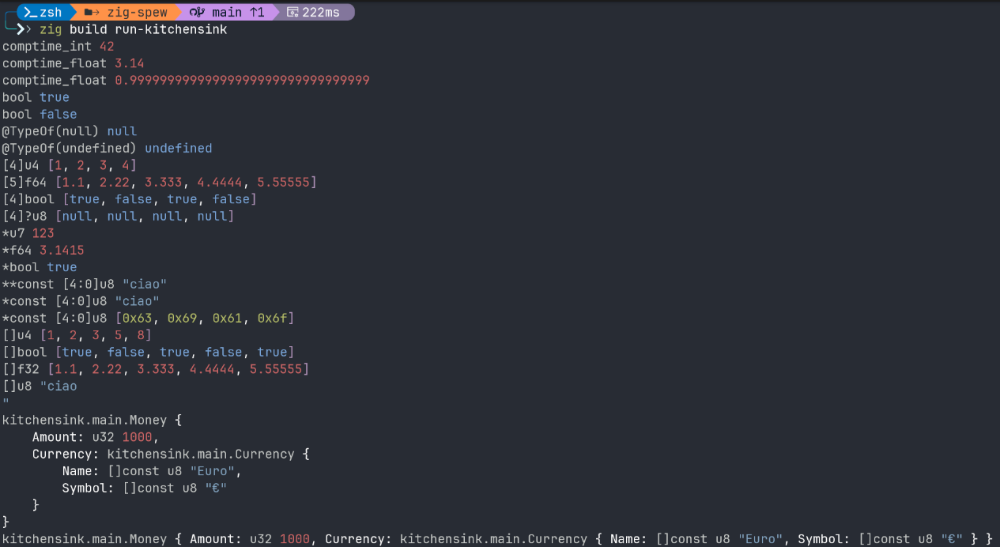

Pretty printer for Zig data structures to help with debugging.



## Badges

[](https://github.com/omissis/zig-spew/releases/latest)
[](https://github.com/omissis/zig-spew/actions?workflow=development)
[](/LICENSE)
[](https://github.com/omissis/zig-spew)
[](https://github.com/omissis/zig-spew)
[](https://github.com/omissis/zig-spew)
[](https://github.com/omissis/zig-spew/commits)

## Example usage

```Zig
const std = @import("std");
const spew = @import("spew.zig");

pub fn main() !void {
    const d = spew.Dumper{};

    const Currency = struct {
        Name: []const u8,
        Symbol: []const u8,
    };
    const Money = struct {
        Amount: u32,
        Currency: Currency,
    };
    const m = Money{
        .Amount = 1000,
        .Currency = .{
            .Name = "Euro",
            .Symbol = "€",
        },
    };

    try d.print(m);

    try spew.dump(m);
}
```
